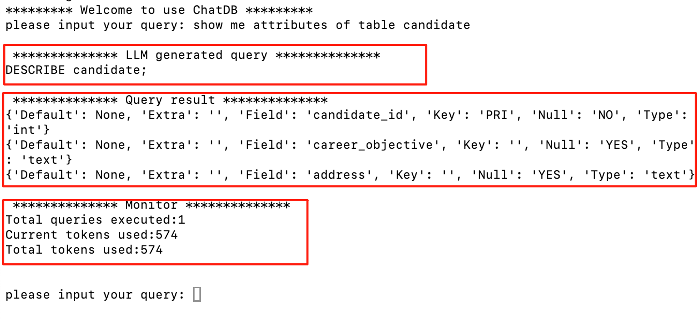

# ChatDB

USC DSCI551 2025 Spring Project

# Overview

- Model: Gemini 2.0 Flash
- Databases: MySQL, MongoDB
- Dataset: Subset of [Resume Dataset (Kaggle)](https://www.kaggle.com/datasets/saugataroyarghya/resume-dataset)
- Schema: `candidates`, `education`, `experience` used in both MySQL and MongoDB

# Project Workflow


#### Result Example.

Three parts: LLM generated query; Query result; Monitor


# Prerequisites

- Python 3.10+
- pip
- [Gemini API Key](https://aistudio.google.com/app/apikey)
- MySQL & MongoDB running locally or remotely (connection info configurable)
- Recommended: virtual environment (`venv`)


# How to Use ChatDB
1. **Clone the repository**
```bash
git clone https://github.com/Wanan-ni/Database_Project.git
```

2. **Create and activate a virtual environment (recommended)**
```bash
# Windows
python -m venv venv
.\venv\Scripts\activate

# macOS/Linux
python3 -m venv venv
source venv/bin/activate
```

3. **Install dependencies**
```bash
pip install -r requirements.txt
```

4. **Configure API key and database access**
Open config.json, then fill in your own Gemini API key and DB credentials.

5. **Start the backend server**

In one terminal, run:

```bash
python main.py
```

Once the server is running at `http://127.0.0.1:5000`, leave this terminal open.

6. **Run the client interface**

In another terminal, run:

```bash
python client.py
```

You will be prompted to input natural language queries:

```bash
please input your query: 
```

3. **Exit**

Type `exit` or `quit` to close the client.

# Mysql Instructions

### Schema Exploration

```sql
generate sql query: show me all tables of nlq_db
```

```sql
generate sql query: describe the schema of candidate table in nlq_db
```

```sql
generate sql query: list all the columns in the candidate table
```

```sql
generate sql query: show 5 example rows from the experience table
```

### CRUD

#### Insert

```sql
generate sql query: insert One example to candidate table, information is candidate_id=11111, career_objective="Make more money"
```

```sql
generate sql query: insert One example to candidate table, information is candidate_id=22222, career_objective="Make more money"
```


```sql
generate sql query: show me all candidates whose career_objective is "Make more money"
```

#### Delete

```sql
generate sql query: delete One example whose candidate_id is 11111
```

```sql
generate sql query: delete examples whose career_objective is "Make more money"
```

```sql
generate sql query: show me all candidates whose career_objective is "Make more money"
```

#### Update one row

```sql
generate sql query: insert one candidate whose candidate_id is 99999 and address is "LA"
```

```sql
generate sql query: update the address of candidate whose candidate_id is 99999 to "New York"
```

```sql
generate sql query: show the address of candidate whose candidate_id is 99999
```

#### Update multiple rows

```sql
generate sql query: If candidates passing_year smaller than 2020, subtract 1 from the value of passing_year
```

### Find

```sql
generate sql query: find distinct candidates all information if their career_objective mentioned AI
```

#### LIMIT, OFFSET

```sql
generate sql query: skip the first 10 candidates and return the next 5
```

### Aggregate

#### COUNT & GROUP BY
```sql
generate sql query: count how many education records there are for each degree type
```

#### AVG & ORDER BY
```sql
generate sql query: compute the average passing year for each degree type, and sort the result by average passing year in descending order
```

#### HAVING

```sql
generate sql query: find all candidates whose number of experiences equals to the absolute maximum number of experiences. Return their candidate_id and the count of their experiences.
```

#### Join

```sql
generate sql query: find how many distinct candidates meet following constraints: they used to be "Software Engineer" and their degree_name is "PhD"(hint: to get correct answer, we need to use three table)
```

# Mongodb Instructions

### Schema Exploration

```sql
generate mongodb query: show me all collections of nlq_db
```

```sql
generate mongodb query: show me schema of candidates
```

```sql
generate mongodb query: show me one example of education
```

```sql
generate mongodb query: show me 5 examples of candidates
```

### CRUD

#### insertOne

```sql
generate mongodb query: insert One example to candidates collection, information is {"candidate_id": 11111, "career_objective":"Make more money"}
```

#### insertMany

```sql
generate mongodb query: insert Many examples to candidates collection, information is {"candidate_id": 22222, "career_objective":"Make more money"}, {"candidate_id": 44444, "career_objective":"Make more money"}, {"candidate_id": 33333, "career_objective":"Make more money"}
```

#### deleteOne

```sql
generate mongodb query: delete One example whose candidate_id is 11111
```

#### deleteMany

```sql
generate mongodb query: delete examples whose career_objective is "Make more money"
```

#### updateOne

```sql
generate mongodb query: update one example: decrement only one candidate passing_year whose passing_year smaller than 2020
```

#### updateMany

```sql
generate mongodb query: If candidates passing_year smaller than 2030, decrement by 5
```

#### Find


```sql
generate mongodb query: find the number of candidates whose career_objective mentioned AI, using method find and count
```

#### Aggregate
$sort, $limit, $skip, $group, $count, $project

```sql
generate mongodb query: find 5 candidates whose experience number is bigger than or equals 2,  return their candidate id, and experience count and sorting by their candidate id, please skip the first 5 results
```
$avg
```sql
generate mongodb query: find average passing year of all candidates
```

$lookup(2 tables), $group, $project

```sql
generate mongodb query: find how many distinct candidates meet following constraints: they used to be "Software Engineer" and their degree name is "PhD"(hint: to get correct answer, we need to use two tables)
```

$lookup(3 tables), $group, $project

```sql
generate mongodb query: find candidates meet following constraints: they used to be "Software Engineer" and their degree name is "PhD"(hint: to get correct answer, we need to use three tables), return their id and address
```
